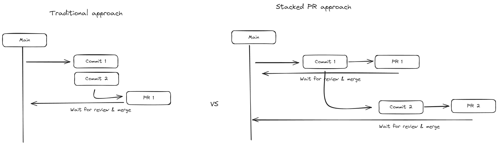

In the realm of software development, efficient code review processes are crucial for maintaining productivity and code quality. One emerging practice gaining traction is the use of Stacked Pull Requests (PRs). This approach has been notably adopted by tech giants like Uber and Meta (formerly Facebook), leveraging tools such as [Graphite](https://graphite.dev/) and [Phabricator](https://www.phacility.com/) (No longer maintained) to streamline their development workflows.

### What are Stacked PRs?

Stacked PRs, also known as stacked diffs or commit-based reviews, represent a paradigm shift from traditional pull requests where multiple commits are bundled together. Instead, each commit stands as an individual unit of change, facilitating more granular review and integration.

### Benefits of Stacked PRs

1. **Incremental Changes**: Stacking allows developers to break down larger changes into smaller, manageable units. Each commit addresses a specific aspect of the feature or bug fix, making it easier to review and test.
   
2. **Faster Review Cycles**: By reducing the size of each PR, the review process becomes more efficient. Reviewers can focus on understanding and validating smaller changes, leading to quicker feedback loops.

3. **Easier Reverts and Debugging**: With each commit being independent, rollbacks are simplified. If a specific change causes issues, reverting it is straightforward without affecting other parts of the codebase.

### How Stacked PRs Work

The workflow with Stacked PRs typically involves the following steps:

- **Creating Small PRs**: Developers make frequent, small commits that address specific tasks or fixes.
  
- **Continuous Rebase**: It's essential to frequently rebase the stacked commits onto the latest version of the base branch. This keeps the changes up-to-date and minimizes conflicts during integration.

- **Individual Review per Commit**: Each commit in a stack undergoes a separate code review. This ensures that every change is thoroughly examined before being merged.

### Challenges and Considerations

While Stacked PRs offer significant advantages, they also introduce some challenges:

- **Tooling Dependence**: Managing stacked commits effectively requires tooling support. While paid tools like Graphite offer comprehensive solutions, free alternatives such as [SPR](https://ejoffe.github.io/spr/) exist but may require more manual intervention.

- **Mindset and Workflow Shift**: Adopting Stacked PRs necessitates a shift in developer mindset. It requires breaking down tasks into smaller, cohesive units, which may initially increase cognitive load.

- **Integration and Dependencies**: When multiple PRs depend on each other, careful coordination is needed to ensure that the codebase remains functional after each commit or PR is integrated.

### Best Practices

To optimize the use of Stacked PRs, consider the following best practices:

- **Small, Atomic Commits**: Each commit should ideally make a minimal, focused change that can be independently reviewed and tested.
  
- **Separate Refactorings**: Refactoring tasks should be handled in separate commits from feature additions or bug fixes to maintain clarity and reduce complexity.

- **Related Tests**: Keep tests closely tied to the changes they verify. Including test updates in the same commit ensures that functionality is thoroughly validated.

### Case Studies and Further Reading

- Uber and Meta have documented their use of Stacked PRs, highlighting improvements in review speed, code quality, and developer satisfaction. More insights can be found in articles like those from [The Pragmatic Engineer](https://newsletter.pragmaticengineer.com/p/stacked-diffs?publication_id=458709&post_id=138048271&isFreemail=true&r=19hdau&utm_source=substack&utm_medium=email) and [Google's Engineering Practices](https://google.github.io/eng-practices/review/developer/small-cls.html).

### Conclusion

In conclusion, while Stacked PRs require initial adjustments in workflow and tooling, their benefits in terms of code review efficiency and codebase maintainability are substantial. By adopting practices similar to those employed by industry leaders like Uber and Meta, teams can enhance collaboration, accelerate development cycles, and ultimately deliver higher-quality software products.

In my professional experience I only used the open source alternative [SPR](https://ejoffe.github.io/spr/). The start has been a bit rusty but then I have found a huge improvement in my productivity and a greater time to market derived from the faster cycle of reviews.
